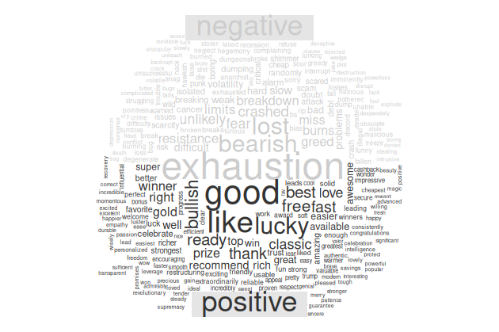

# tsentiment

## Introduction
tsentiment is a sentiment analysis package created with R programming language.
Just a Twitter account will be required to use this tool.
For sentiment analysis, tsentiment scans the keyword you want to search for, and presents two visual results to the user as a result of the process.

## Installation
```
> install.packages("tsentiment")
```
## Limitation
- request limit 150 ( each request retrieving 15 tweet and 150 requests are redefined every 15 minutes )
- accept only english words for search

## Use Case
- If you have a twitter account, authorize your account in the tsentiment application at <a href="https://app.tsentiment.com">app.tsentiment.com</a>
- Define your user token to tsentiment package after authorization
- In R console typing this conditions
```
> library("tsentiment")
> setAccount(list(
    BEARER_TOKEN = "Your-User-Token",
    query = "Your-Keyword"
))
// Note : after use setAccount required give permission for writing result files.
> getAnalysis()

```

Its simple !

After complete analysis check your Documents and you will see results directory. All succesful results saving this location.

IMPORTANT NOTE : The previous analysis file are deleted before each new analysis file is created.

## Example Results




## Error and Warning meanings
- Too Many Requests 429 (You've reached your rate limit in 15 minute rule. Try 15 minute later)
- Need Twitter Auth 406 (You most likely entered the wrong user token. Use setAccount again)

## Policy & Terms
- Policy : https://app.tsentiment.com/policy
- Terms : https://app.tsentiment.com/terms